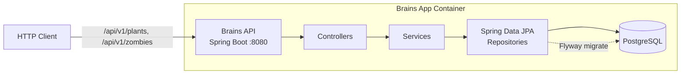
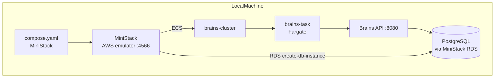
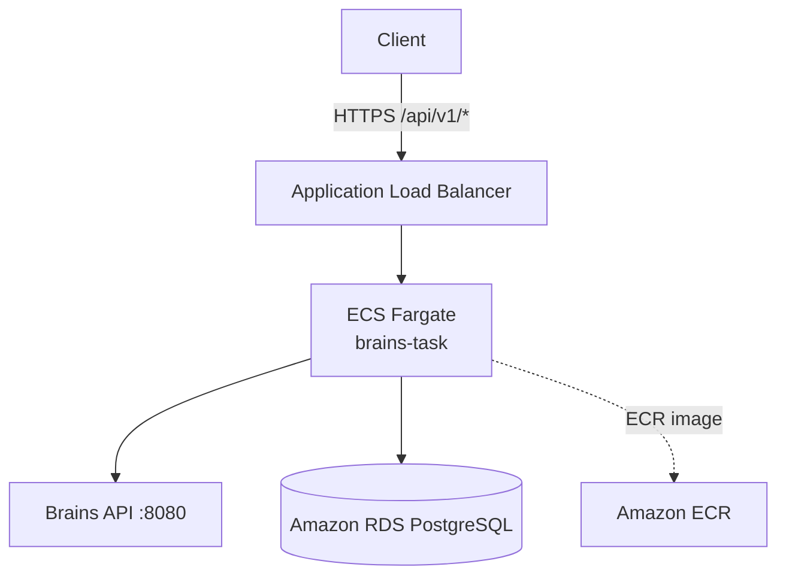

# Brains

A Plants vs. Zombies 1 almanac REST API built with **Spring Boot 4** and **PostgreSQL**. It exposes paginated, filterable endpoints for exploring plant and zombie almanac entries — complete with database migrations, Docker containerization, and a local ECS Fargate deployment via MiniStack.

## Features

- **Almanac API** — List and retrieve PvZ1 plants and zombies with optional filtering and sorting via `GET /api/v1/plants` and `GET /api/v1/zombies`.
- **Identifier lookup** — Fetch a single entry by numeric ID or normalized name/slug (e.g. `peashooter`, `buckethead-zombie`).
- **Filtering & pagination** — Filter by name, toughness, recharge speed, damage, and behavioral flags; paginated responses with Spring Data.
- **Flyway migrations** — Version-controlled schema and seed data (`V1__schema.sql`, `V2__seed.sql`) with Hibernate `ddl-auto: validate`.
- **RESTful error handling** — RFC 7807 `ProblemDetail` responses and a global exception handler.
- **OpenAPI / Swagger UI** — Auto-generated interactive API documentation.
- **Testcontainers** — JUnit test suites backed by a real PostgreSQL container.
- **Actuator** — Health checks and service info endpoints.
- **Containerized & deployable** — Multi-stage Docker build plus a scripted local deploy to ECS Fargate on MiniStack; ECS task definition ready for AWS.

## Tech Stack

| Layer        | Technology                             |
|--------------|----------------------------------------|
| Language     | Java 25                                |
| Framework    | Spring Boot 4.1.1 (Spring MVC)         |
| Persistence  | Spring Data JPA + Flyway               |
| Database     | PostgreSQL                             |
| API Docs     | springdoc-openapi (Swagger UI)         |
| Build        | Gradle (Kotlin DSL)                    |
| Ops          | Docker, Docker Compose, AWS ECS (Fargate) |

## Project Structure

```
brains/
├── build.gradle.kts          # Gradle build (Kotlin DSL)
├── compose.yaml              # Local MiniStack (local AWS emulator + Postgres)
├── Dockerfile                # Multi-stage container build
├── ecs-task-def.json         # ECS Fargate task definition
├── ministack-init/           # RDS provisioning for MiniStack
├── scripts/
│   ├── deploy-local.sh       # Local MiniStack ECS deploy
│   └── deploy-local.ps1      # PowerShell equivalent
└── src/
    ├── main/java/io/shnflrsc/brains/
    │   ├── controller/       # REST controllers (plants, zombies)
    │   ├── service/          # Business logic
    │   ├── repository/       # Spring Data repositories + specs
    │   ├── model/            # JPA entities & enums
    │   ├── dto/              # Request/response DTOs
    │   ├── config/           # OpenAPI + web configuration
    │   └── exception/        # Global error handling
    └── main/resources/
        ├── application.yaml  # Main configuration
        ├── application-dev.yaml
        └── db/migration/     # Flyway schema & seed migrations
```

## Infrastructure

The local development environment emulates the production AWS topology using **MiniStack** (an AWS service emulator). The API itself is designed to run as a containerized Fargate task backed by a PostgreSQL database.



### Local Deployment (MiniStack ECS Fargate)

The local deploy mirrors the production architecture using MiniStack to emulate AWS services:



### Planned Production (AWS)



## Setup

### Prerequisites

- **Java 25** (JDK toolchain)
- **Docker** with **Docker Compose**
- **AWS CLI** (used only for the local MiniStack deploy)
- **Git**

### 1. Clone the repository

```bash
git clone https://github.com/shnflrsc/brains.git
cd brains
```

### 2. Configure environment variables

Copy `.env.example` to `.env` and fill in your PostgreSQL credentials (the same values are used by both the app and MiniStack RDS):

```bash
cp .env.example .env
```

`.env.example`:

```ini
POSTGRES_DB=brains
POSTGRES_USER=postgres
POSTGRES_PASSWORD=postgres
```

### 3. Start the local infrastructure (MiniStack)

The compose file starts MiniStack (which emulates AWS services including RDS) and exposes PostgreSQL on port `15432`.

```bash
docker compose up -d
```

MiniStack's init scripts provision the RDS PostgreSQL instance (`brains-postgres`) automatically.

### 4. Run the application

Build and run with Gradle (Java 25 required):

```bash
./gradlew bootRun
```

The app connects to PostgreSQL at `localhost:15432` by default. Flyway applies the schema and seed migrations on startup.

> **Tip:** To connect to a plain local PostgreSQL on port `5432` (instead of MiniStack's), run with the `dev` profile:
>
> ```bash
> ./gradlew bootRun --args='--spring.profiles.active=dev'
> ```

### 5. Build and run the tests

```bash
./gradlew test
```

The test suite uses **Testcontainers** to spin up an isolated PostgreSQL container.

## API Reference

Interactive documentation is available at **Swagger UI** once the app is running:

- Swagger UI: `http://localhost:8080/swagger-ui/index.html`
- OpenAPI JSON: `http://localhost:8080/v3/api-docs`

### Endpoints

| Method | Path                      | Description                                        |
|--------|---------------------------|----------------------------------------------------|
| `GET`  | `/api/v1/plants`          | List plants (paginated, filterable, sortable)      |
| `GET`  | `/api/v1/plants/{id\|slug}` | Get a single plant by ID or normalized name      |
| `GET`  | `/api/v1/zombies`         | List zombies (paginated, filterable, sortable)     |
| `GET`  | `/api/v1/zombies/{id\|slug}` | Get a single zombie by ID or normalized name    |
| `GET`  | `/actuator/health`        | Health check                                      |
| `GET`  | `/actuator/info`          | Service information                               |

### Example

Fetch a plant by slug:

```bash
curl http://localhost:8080/api/v1/plants/peashooter
```

```json
{
  "id": 1,
  "name": "Peashooter",
  "description": "Peashooters are your first line of defense. They shoot peas at attacking zombies.",
  "toughness": "NORMAL",
  "sunCost": 100,
  "recharge": "FAST",
  "damage": "NORMAL",
  "range": "Straight"
}
```

## Local Deployment to ECS Fargate (MiniStack)

With MiniStack running, you can simulate a full ECS Fargate deploy end-to-end:

```bash
./scripts/deploy-local.sh
```

This script:

1. Verifies MiniStack connectivity.
2. Provisions the RDS PostgreSQL instance (`brains-postgres`) if it doesn't exist.
3. Builds the Docker image.
4. Registers the ECS task definition from `ecs-task-def.json`.
5. Ensures the `brains-cluster` exists.
6. Runs the task on Fargate and prints the service endpoints.

Equivalent PowerShell: `./scripts/deploy-local.ps1`.

## Building the Docker Image

```bash
docker build -t brains:latest .
```

The multi-stage `Dockerfile` builds the Spring Boot fat JAR and runs it as a non-root user on JRE 25, exposing port `8080`.

## Health

The actuator exposes liveness/readiness probes (enabled via `management.endpoint.health.probes.enabled`):

```bash
curl http://localhost:8080/actuator/health
```
